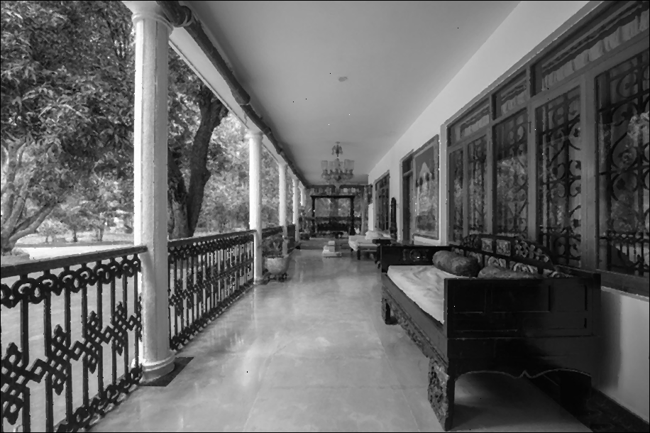

# Image-Processing
Gaussian, Salt and Pepper noise in images and Mean, Median filtering. 
The original rgb image is converted into Grayscale and then we apply 
Gaussian and Salt & Pepper noise. 

Gaussian Noise

Salt and Pepper Noise

Then we attempt to remove the noise by applying the Median and 
Mean filtering methods in our corrupted images.
Median Filtering

Mean Filtering 
